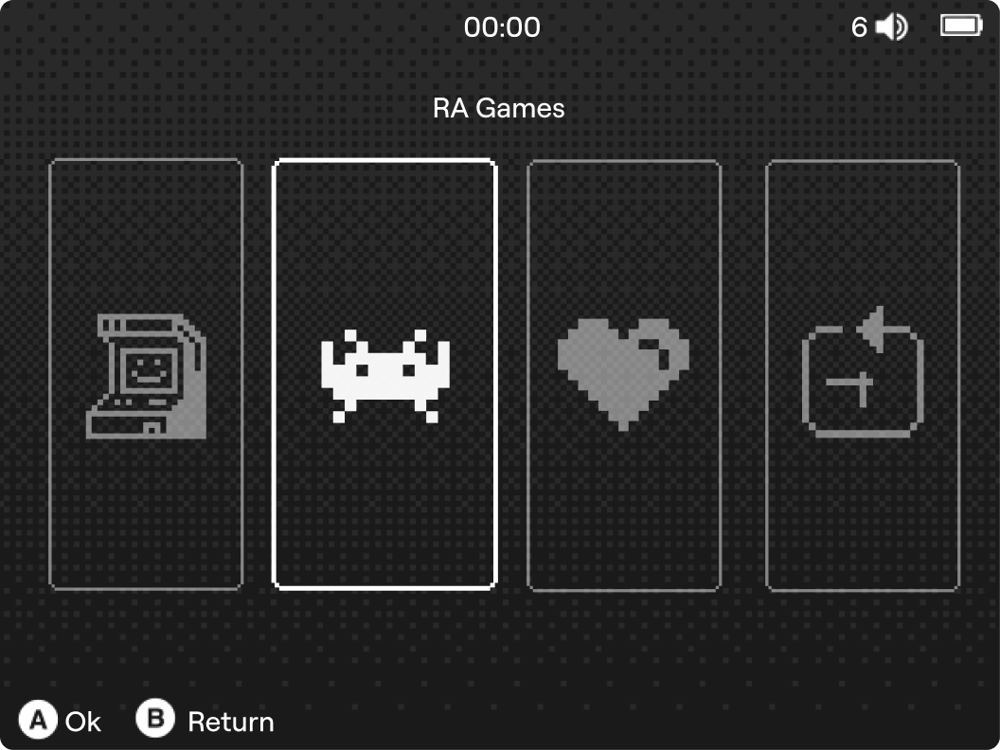

# MiniPixel Theme for Anbernic RG35XX Family

MiniPixel is a clean and minimalistic theme for modded stock OS on the Anbernic RG35XX family of devices. It is inspired by the **Minimal** theme by InfraBlue and features pixel-style icons for a cohesive retro aesthetic.


## Installation Guide

### Prerequisites
Before installing the MiniPixel theme, you must have a modded version of the stock OS. Follow the instructions at the link below to modify your OS:
[Anbernic-H700-RG-xx-StockOS-Modification](https://github.com/cbepx-me/Anbernic-H700-RG-xx-StockOS-Modification)

### Steps to Install
1. **Mod Your Stock OS** – Ensure your device is running the modded version of the stock OS.
2. **Download & Unzip** – Extract the MiniPixel theme archive.
3. **Move the Theme Folder** – Copy the extracted folder to:
   ```
   Roms/APPS/themes_ins/640x480
   ```
4. **Apply the Theme**:
   - Navigate to **App Center > Apps**
   - Launch **Theme_Manager**
   - Select **MiniPixel** and apply it

## Credits
- **Based on:** [Minimal theme by InfraBlue](https://plus.rg35xx.com/en/customization/stockos-themes/)
- **Icons:** [1,300+ Free Pixel Icons](https://www.figma.com/community/file/1196864707579677521/1-300-free-pixel-icons-vector-pixel-icons-svg)


---
Enjoy your new MiniPixel theme! 😊

